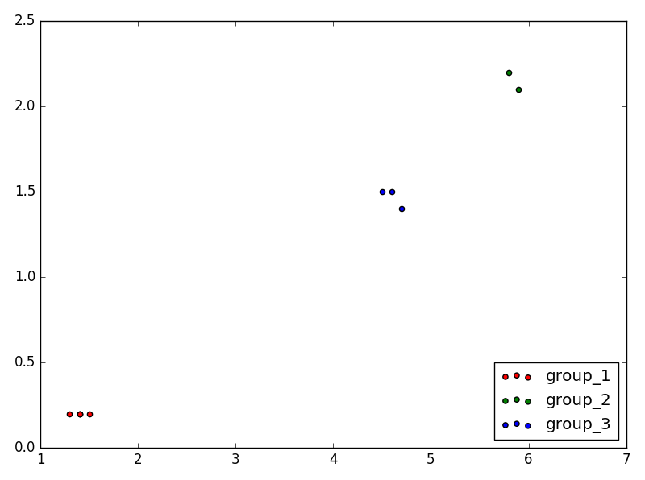

# Clustering - kMeans and DBSCAN

- Objective

  - Implementation  of kMeans and DBSCAN with python

- Toolkit

  - Python 2.7 or 3.5

  - Numpy version >= 1.13.1

- Run

  - modify `main.py` to switch Clustering Algorithm(default is `DBSCAN`) and set parameters

  - run `python main.py` in terminal

  - Then you would see clustering result, such like `C_cluster=[{1,2,3...}, {5,7,8...}]`

    

